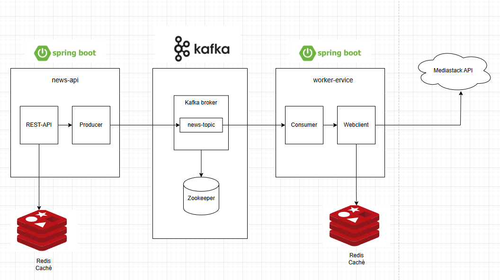

# Proyecto Spring Boot con Kafka, Redis, Docker y Mediastack

## Acerca del Proyecto

Este proyecto demuestra el uso del broker de mensajes Apache Kafka para establecer comunicación entre microservicios utilizando Spring Boot.

### Arquitectura del Proyecto
<p align="center">
  
</p>

En este ejemplo, uno de los servicios recolecta noticias desde una API externa de noticias (Mediastack) y se comunica con otro servicio mediante Kafka. Redis se utiliza para almacenar en caché los datos obtenidos.

El proyecto incluye los siguientes componentes:

- Dos microservicios desarrollados en Spring Boot:
    - `user-api` (expuesto como API REST)
    - `worker-service` (servicio worker que recolecta datos desde la API de noticias)
- Zookeeper (necesario para ejecutar Kafka)
- Apache Kafka como broker de mensajes
- Redis para almacenamiento en caché
- API externa de noticias ([Mediastack](https://mediastack.com/documentation))
- Docker (para ejecutar todos los servicios)

---

## Configuración del Proyecto

Para ejecutar este proyecto, sigue los siguientes pasos:

### 1. Clona el repositorio

```bash
git clone https://github.com/UserAccount11/spring-kafka-redis-root-project.git
cd spring-kafka-redis-root-project
```

### 2. Configura tu clave de API de Mediastack

Crea una cuenta gratuita en [Mediastack](https://mediastack.com/documentation) y obtén tu clave de API. Luego, reemplaza la variable de entorno `MEDIASTACK_API_KEY` dentro del archivo `docker-compose.yml`, específicamente en el servicio `worker-service`:

```yaml
environment:
  MEDIASTACK_API_KEY: <tu_clave_api_aquí>
```

---

## Cómo Ejecutar el Proyecto

Una vez configurada la clave de API, simplemente ejecuta:

```bash
docker-compose up -d --build
```

Esto construirá y levantará todos los contenedores necesarios: `user-api`, `worker-service`, Kafka, Zookeeper y Redis.

Puedes verificar que los contenedores estén corriendo correctamente con:

```bash
docker ps

CONTAINER ID   IMAGE                              COMMAND                  CREATED        STATUS        PORTS                                         NAMES
baea70b7acfe   news-api:latest                    "sh -c 'java -jar ne…"   17 hours ago   Up 17 hours   0.0.0.0:8080->8080/tcp                        news-api
fb154c841add   worker-service:latest              "sh -c 'java -jar wo…"   17 hours ago   Up 17 hours   0.0.0.0:8081->8081/tcp                        worker-service
4b4e7ad3fa79   confluentinc/cp-kafka:latest       "/etc/confluent/dock…"   17 hours ago   Up 17 hours   9092/tcp, 0.0.0.0:29092->29092/tcp            spring-kafka-redis-root-project-kafka-1
9452e62caf7f   redis:latest                       "docker-entrypoint.s…"   17 hours ago   Up 17 hours   0.0.0.0:6379->6379/tcp                        spring-kafka-redis-root-project-redis-1
61fb2a72285f   confluentinc/cp-zookeeper:latest   "/etc/confluent/dock…"   17 hours ago   Up 17 hours   2888/tcp, 3888/tcp, 0.0.0.0:22181->2181/tcp   spring-kafka-redis-root-project-zookeeper-1
b9159f8d5310   moby/buildkit:buildx-stable-1      "buildkitd --allow-i…"   17 hours ago   Up 17 hours                                                 buildx_buildkit_crazy_austin0                    "docker-entrypoint.s…"   47 hours ago    Up 12 hours   0.0.0.0:6379->6379/tcp                        monorepo-redis-1
```


---

## Endpoints Disponibles

Actualmente, el proyecto expone el siguiente endpoint:

- **GET** `http://localhost:8080/news?date=<fecha>`
    - Parámetro: `date` en formato `yyyy-MM-dd`
    - Ejemplo: `http://localhost:8080/news?date=2024-04-10`

---

## Notas Adicionales

- Puedes modificar configuraciones como puertos, claves, temas de Kafka, etc., editando el archivo [`docker-compose.yml`](./docker-compose.yml).
- No es necesario ejecutar los servicios manualmente ni instalar Kafka, Zookeeper o Redis localmente, ya que todo está contenido dentro del entorno Docker.
